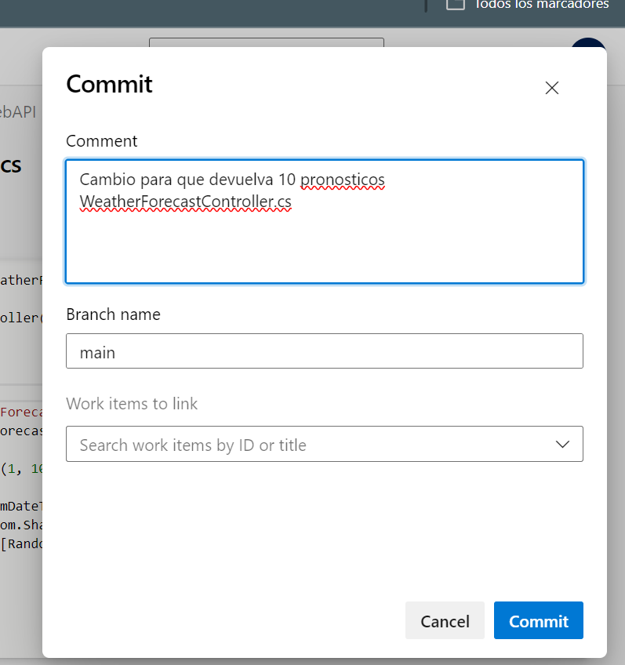
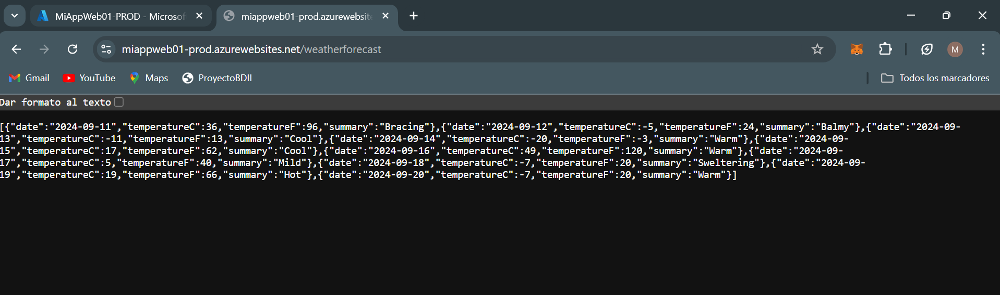

Desarrollo:
4.1. Crear una cuenta en Azure
Ya tenia creada una. 
4.2. Crear un recurso Web App en Azure Portal y navegar a la url provista
   
   
   
   Navegamos a la URL provista:
   
4.3. Actualizar Pipeline de Build para que use tareas de DotNetCoreCLI@2 como en el pipeline clásico, luego crear un Pipeline de Release en Azure DevOps con CD habilitada
   
   
   
   Creamos pipeline de release:
  
  
  
  Habilitamos CD:
  
  
  
  
4.4. Optimizar Pipeline de Build

4.5. Verificar el deploy en la url de la WebApp /weatherforecast

4.6. Realizar un cambio al código del controlador para que devuelva 7 pronósticos, realizar commit, evaluar ejecución de pipelines de build y release, navegar a la url de la webapp/weatherforecast y corroborar cambio
Hacemos cambio para que devuelva 7 pronosticos:

Vemos que efectivamente nos muestra 7 pronosticos:

4.7. Clonar la Web App de QA para que contar con una WebApp de PROD a partir de un Template Deployment en Azure Portal y navegar a la url provista para la WebApp de PROD.

Vemos que se ha clonado la web app correctamente: 

4.8. Agregar una etapa de Deploy a Prod en Azure Release Pipelines

4.9. Realizar un cambio al código del controlador para que devuelva 10 pronósticos, realizar commit, evaluar ejecución de pipelines de build y release, navegar a la url de la webapp/weatherforecast y corroborar cambio, verificar que en la url de la webapp_prod/weatherforecast se muestra lo mismo.

4.10. Modificar pipeline de release para colocar una aprobación manual para el paso a Producción.

4.11. Realizar un cambio al código del controlador para que devuelva 5 pronósticos, realizar commit, evaluar ejecución de pipelines de build y release, navegar a la url de la webapp/weatherforecast y corroborar cambio, verificar que en la url de la webapp_prod/weatherforecast aun se muestra la versión anterior.
Hacemos cambio para que devuelva 5 pronosticos:

Vemos que la webapp si nos muestra el cambio: 

EN cambio, en webapp-prod, como no aceptamos el cambio, sigue mostrando 7: 

4.12. Aprobar el pase ya sea desde el release o desde el mail recibido. 
4.12.1. Notar que se puede dar la aprobación pero posponer su aplicación hasta una determinada fecha
4.13. Esperar a la finalización de la etapa de Pase a Prod y luego corroborar que en la url de la webapp_prod/weatherforecast se muestra la nueva versión coinicidente con la de QA. image

Y vemos como muestra los 10 pronosticos:

4.14. Realizar un pipeline (no release) que incluya el deploy a QA y a PROD con una aprobación manual. El pipeline debe estar construido en YAML sin utilizar el editor clásico de pipelines ni el editor clásico de pipelines de release.

