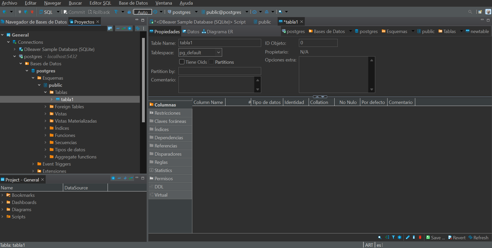

## Trabajo Práctico 2 - Introducción a Docker

## 4- Desarrollo:

#### 1- Instalar Docker Community Edition 
  - Diferentes opciones para cada sistema operativo
  - https://docs.docker.com/
  - Ejecutar el siguiente comando para comprobar versiones de cliente y demonio.
```bash
docker version
```
   

#### 2- Explorar DockerHub
   - Registrase en docker hub: https://hub.docker.com/
   - Familiarizarse con el portal

#### 3- Obtener la imagen BusyBox
  - Ejecutar el siguiente comando, para bajar una imagen de DockerHub
  ```bash
  docker pull busybox
  ```
   

  - Verificar qué versión y tamaño tiene la imagen bajada, obtener una lista de imágenes locales:
```bash
docker images
```
   


#### 4- Ejecutando contenedores
  - Ejecutar un contenedor utilizando el comando **run** de docker:
```bash
docker run busybox
```
   

  - Explicar porque no se obtuvo ningún resultado

  - Especificamos algún comando a correr dentro del contenedor, ejecutar por ejemplo:
```bash
docker run busybox echo "Hola Mundo"
```
   

  - Ver los contenedores ejecutados utilizando el comando **ps**:
```bash
docker ps
```
   

  - Vemos que no existe nada en ejecución, correr entonces:
```bash
docker ps -a
```
   

  - Mostrar el resultado y explicar que se obtuvo como salida del comando anterior.

#### 5- Ejecutando en modo interactivo

  - Ejecutar el siguiente comando
```bash
docker run -it busybox sh
```

  - Para cada uno de los siguientes comandos dentro de contenedor, mostrar los resultados:
```bash
ps
uptime
free
ls -l /
```
   

  - Salimos del contenedor con:
```bash
exit
```

#### 6- Borrando contenedores terminados

  - Obtener la lista de contenedores 
```bash
docker ps -a
```
   

  - Para borrar podemos utilizar el id o el nombre (autogenerado si no se especifica) de contenedor que se desee, por ejemplo:
```bash
docker rm elated_lalande
```
   

  - Para borrar todos los contenedores que no estén corriendo, ejecutar cualquiera de los siguientes comandos:
```bash
docker rm $(docker ps -a -q -f status=exited)
```
```bash
docker container prune
```
   

#### 7- Construir una imagen
- Conceptos de DockerFile
  - Leer https://docs.docker.com/engine/reference/builder/ 
  - Describir las instrucciones
     - FROM
     - RUN
     - ADD
     - COPY
     - EXPOSE
     - CMD
     - ENTRYPOINT
- A partir del código https://github.com/ingsoft3ucc/SimpleWebAPI crearemos una imagen.
- Clonar repo
     

- Crear imagen etiquetándola con un nombre. El punto final le indica a Docker que use el dir actual
```
docker build -t mywebapi .
```
   

- Revisar Dockerfile y explicar cada línea
  #See https://aka.ms/containerfastmode to understand how Visual Studio uses this Dockerfile to build your images for faster debugging.
Este comentario proporciona un enlace a la documentación de Visual Studio sobre cómo utiliza este Dockerfile para construir imágenes rápidamente durante la depuración.
FROM mcr.microsoft.com/dotnet/aspnet:7.0 AS base
Define la imagen base que se utilizará para ejecutar la aplicación. En este caso, se utiliza la imagen aspnet:7.0 que contiene .NET Runtime, optimizado para ejecutar aplicaciones ASP.NET Core.
WORKDIR /app
Establece el directorio de trabajo dentro del contenedor. Aquí es donde se copiarán y ejecutarán los archivos de la aplicación.
EXPOSE 80
EXPOSE 443
EXPOSE 5254
Declara que el contenedor escucha en los puertos 80, 443 y 5254. Aunque EXPOSE no publica los puertos hacia fuera del contenedor, documenta los puertos en los que la aplicación está diseñada para escuchar.
FROM mcr.microsoft.com/dotnet/sdk:7.0 AS build
Utiliza la imagen sdk:7.0 de .NET, que incluye el SDK necesario para compilar aplicaciones .NET. Este es un stage separado llamado build.
WORKDIR /src
Cambia el directorio de trabajo a /src, que es donde se ubicará el código fuente durante la compilación.
COPY ["SimpleWebAPI/SimpleWebAPI.csproj", "SimpleWebAPI/"]
Copia el archivo del proyecto SimpleWebAPI.csproj desde tu máquina local al contenedor en la ruta SimpleWebAPI/.
RUN dotnet restore "SimpleWebAPI/SimpleWebAPI.csproj"
Ejecuta dotnet restore para restaurar las dependencias del proyecto especificadas en el archivo .csproj. Esto prepara el entorno para la compilación.
COPY . .
Copia todos los archivos y directorios del contexto de construcción actual (la carpeta raíz del proyecto en tu máquina) al contenedor.
WORKDIR "/src/SimpleWebAPI"
Cambia el directorio de trabajo al que contiene el código fuente del proyecto (SimpleWebAPI).
RUN dotnet build "SimpleWebAPI.csproj" -c Release -o /app/build
Compila la aplicación en modo Release y coloca los archivos compilados en el directorio /app/build dentro del contenedor.
FROM build AS publish
Inicia un nuevo stage llamado publish que comienza desde el stage build. Este es un patrón común para separar la compilación de la publicación.
RUN dotnet publish "SimpleWebAPI.csproj" -c Release -o /app/publish /p:UseAppHost=false
Publica la aplicación en modo Release, colocando los archivos de salida en el directorio /app/publish. La opción /p:UseAppHost=false indica que no se debe generar un archivo ejecutable de host (solo se genera un DLL).
FROM base AS final
 Inicia el último stage llamado final, basado en la imagen base (la imagen aspnet:7.0 utilizada al principio).
WORKDIR /app
Cambia el directorio de trabajo al directorio /app, donde se desplegará la aplicación final.
COPY --from=publish /app/publish .
Copia los archivos publicados desde el stage publish al directorio de trabajo /app en el stage final.
#ENTRYPOINT ["dotnet", "SimpleWebAPI.dll"]
Comentado en este caso, pero normalmente se usaría para definir el comando que se ejecuta cuando se inicia el contenedor, que en este caso sería dotnet SimpleWebAPI.dll para ejecutar la aplicación.
CMD ["/bin/bash"]
 En lugar de ejecutar la aplicación, este CMD indica que el contenedor debe iniciar una sesión de Bash, lo que es útil para depuración. Este comando se usa por defecto cuando se inicia el contenedor, pero puede ser sobrescrito.
- Ver imágenes disponibles
     

- Ejecutar un contenedor con nuestra imagen
     

- Subir imagen a nuestra cuenta de dockerhub
  - 7.1 Inicia sesión en Docker Hub
    - Primero, asegúrate de estar autenticado en Docker Hub desde tu terminal:
    ```bash
    docker login
    ```
       

  - 7.2 Etiquetar la imagen a subir con tu nombre de usuario de Docker Hub y el nombre de la imagen. Por ejemplo:
    ```bash
    docker tag <nombre_imagen_local> <tu_usuario_dockerhub>/<nombre_imagen>:<tag>
    ```

  - 7.3 Subir la Imagen
    - Para subir la imagen etiquetada a Docker Hub, utiliza el comando docker push:
     ```bash
     docker push <tu_usuario_dockerhub>/<nombre_imagen>:<tag>
     ```
    

  - 7.4 Verificar la Subida
     ```bash
     docker pull <tu_usuario_dockerhub>/<nombre_imagen>:<tag>
     ```
       

#### 8- Publicando puertos

En el caso de aplicaciones web o base de datos donde se interactúa con estas aplicaciones a través de un puerto al cual hay que acceder, estos puertos están visibles solo dentro del contenedor. Si queremos acceder desde el exterior deberemos exponerlos.

  - Ejecutar la siguiente imagen, en este caso utilizamos la bandera -d (detach) para que nos devuelva el control de la consola:

```bash
docker run --name myapi -d mywebapi
```
  

  - Ejecutamos un comando ps:
      
  - Vemos que el contendor expone 3 puertos el 80, el 5254 y el 443, pero si intentamos en un navegador acceder a http://localhost/WeatherForecast no sucede nada.

  - Procedemos entonces a parar y remover este contenedor:
```bash
docker kill myapi
docker rm myapi
```
  

  - Vamos a volver a correrlo otra vez, pero publicando el puerto 80

```bash
docker run --name myapi -d -p 80:80 mywebapi
```
   

  - Accedamos nuevamente a http://localhost/WeatherForecast y vemos que nos devuelve datos.
       

#### 9- Modificar Dockerfile para soportar bash 

- Modificamos dockerfile para que entre en bash sin ejecutar automaticamente la app

 
```bash
#ENTRYPOINT ["dotnet", "SimpleWebAPI.dll"]
CMD ["/bin/bash"]
```
   

- Rehacemos la imagen
```
docker build -t mywebapi .
```
 

- Corremos contenedor en modo interactivo exponiendo puerto
```
docker run -it --rm -p 80:80 mywebapi
```
  

- Navegamos a http://localhost/weatherforecast
- Vemos que no se ejecuta automaticamente
         

- Ejecutamos app:
```
dotnet SimpleWebAPI.dll
```
  

-Volvemos a navegar a http://localhost/weatherforecast
       

- Salimos del contenedor


  
#### 10- Montando volúmenes

Hasta este punto los contenedores ejecutados no tenían contacto con el exterior, ellos corrían en su propio entorno hasta que terminaran su ejecución. Ahora veremos cómo montar un volumen dentro del contenedor para visualizar por ejemplo archivos del sistema huésped:

  - Ejecutar el siguiente comando, cambiar myusuario por el usuario que corresponda. En Mac puede utilizarse /Users/miusuario/temp):
```bash
docker run -it --rm -p 80:80 -v /Users/miuser/temp:/var/temp  mywebapi
```
  - Dentro del contenedor correr
```bash
ls -l /var/temp
touch /var/temp/hola.txt
```
  

  - Verificar que el Archivo se ha creado en el directorio del guest y del host.
  

#### 11- Utilizando una base de datos
- Levantar una base de datos PostgreSQL

```bash
mkdir $HOME/.postgres

docker run --name my-postgres -e POSTGRES_PASSWORD=mysecretpassword -v $HOME/.postgres:/var/lib/postgresql/data -p 5432:5432 -d postgres:9.4
```
  

- Ejecutar sentencias utilizando esta instancia

```bash
docker exec -it my-postgres /bin/bash

psql -h localhost -U postgres

#Estos comandos se corren una vez conectados a la base

\l
create database test;
\connect test
create table tabla_a (mensaje varchar(50));
insert into tabla_a (mensaje) values('Hola mundo!');
select * from tabla_a;

\q

exit
```
  

- Conectarse a la base utilizando alguna IDE (Dbeaver - https://dbeaver.io/, Azure DataStudio -https://azure.microsoft.com/es-es/products/data-studio, etc). Interactuar con los objectos objectos creados.
  
    


- Explicar que se logro con el comando `docker run` y `docker exec` ejecutados en este ejercicio.
El comando docker run creó y ejecutó un contenedor de Docker que ejecuta PostgreSQL versión 9.4. La base de datos está configurada para escuchar en el puerto 5432 y utiliza mysecretpassword como contraseña para el usuario postgres. Los datos de la base de datos se almacenan de forma persistente en la carpeta $HOME/.postgres de mi máquina local. El comando exec: me conectó a una sesión de bash dentro del contenedor my-postgres, permitiéndome ejecutar comandos directamente dentro del entorno del contenedor. Es útil para realizar tareas de administración, depuración, o inspección del estado del contenedor y la base de datos que está ejecutando. Resumiendo, con docker run, se creó y lanzó un contenedor que ejecuta PostgreSQL, con configuración personalizada. Con docker exec, me conecté al contenedor en ejecución para interactuar con él mediante una terminal bash.
#### 12- Hacer el punto 11 con Microsoft SQL Server
- Armar un contenedor con SQL Server
      
      
    
    
    


- Crear BD, Tablas y ejecutar SELECT
      

#### 13- Presentación del trabajo práctico.

Subir un archivo md (puede ser en una carpeta) trabajo-practico-02 con las salidas de los comandos utilizados. Si es necesario incluir también capturas de pantalla.
