 Pasos del TP
4.1 Verificar acceso a Pipelines concedido
   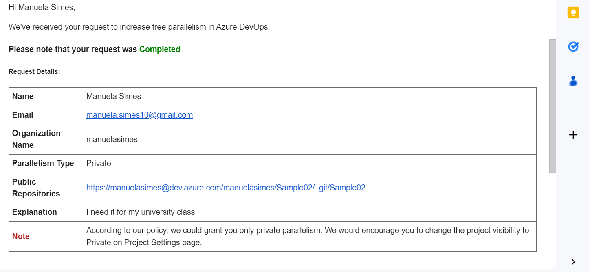

4.2 Agregar en pipeline YAML una tarea de Publish.
   

4.3 Explicar por qué es necesario contar con una tarea de Publish en un pipeline que corre en un agente de Microsoft en la nube.
Por varias razones contar con una tarea publish es crucial. Primero, una tarea de Publish permite empaquetar y publicar los artefactos generados (como compilaciones, binarios, 
archivos de configuración, etc.) para que puedan ser usados en etapas posteriores del pipeline, como en pruebas, despliegue en entornos de producción o compartidos con otros 
equipos. Sin esta tarea, los artefactos producidos durante la ejecución del pipeline no estarían accesibles para su distribución. Además, publicar los artefactos asegura que 
los resultados de la ejecución se almacenen de manera persistente en un servidor de artefactos o en un almacenamiento designado para futuras referencias.
En un flujo de trabajo de integración y entrega continua (CI/CD), los artefactos publicados se utilizan para desplegar aplicaciones en diferentes entornos (staging, producción, etc.). 
Publicar estos artefactos es un paso necesario para garantizar que el código que pasa las pruebas y validaciones pueda ser desplegado de manera confiable y automatizada.
A su vez, permite llevar un historial de los builds y artefactos generados, lo cual es importante para rastrear cambios, realizar auditorías, o restaurar versiones anteriores si es necesario.
4.4 Descargar el resultado del pipeline y correr localmente el software compilado.
   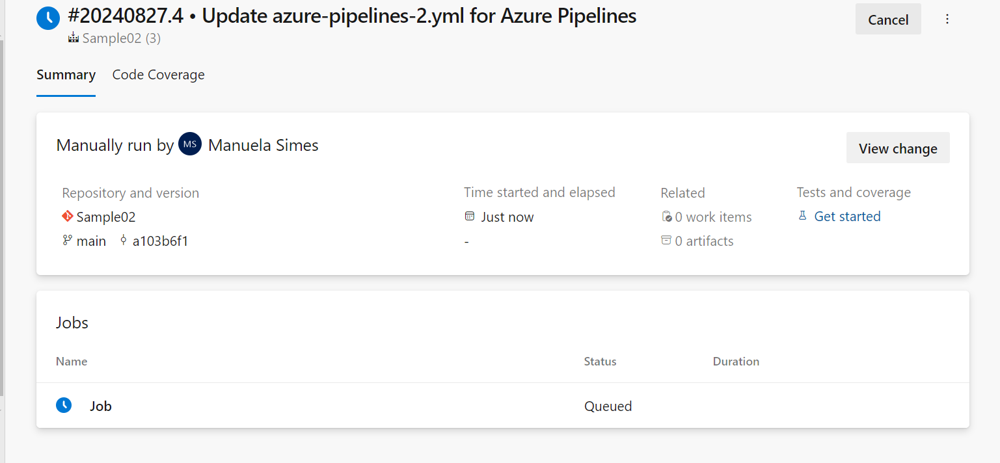
   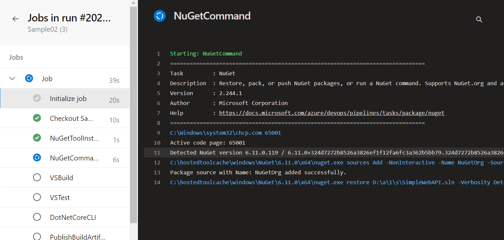
   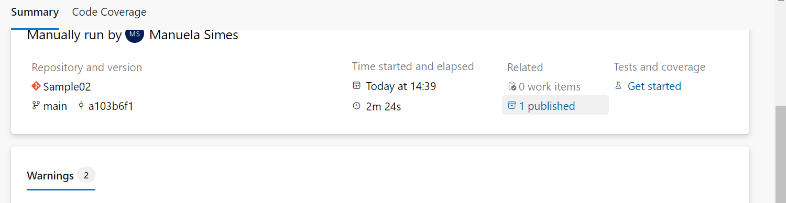
   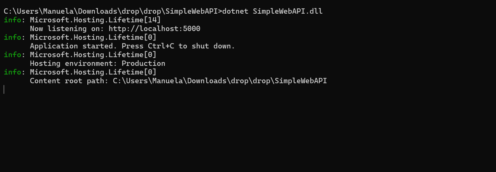

4.5 Habilitar el editor clásico de pipelines. Explicar las diferencias claves entre este tipo de editor y el editor YAML.
   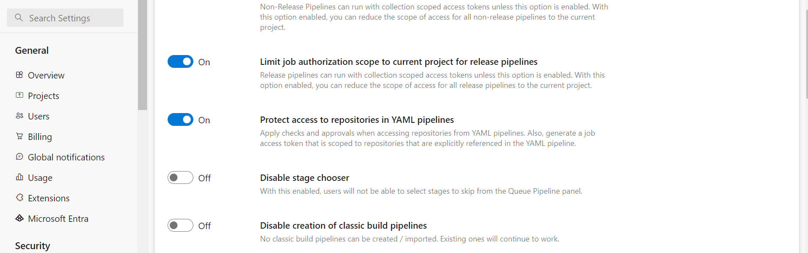
   Sus diferencias claves s encuentran en: 
   1. Interfaz de Usuario o Codigo: EL editor clasico se basa en una interfaz gráfica de usuario (GUI) donde los usuarios configuran el pipeline utilizando formularios, cuadros de diálogo y opciones desplegables.
      Mientras que el editor YAML, los pipelines se configuran escribiendo directamente en un archivo YAML, lo que implica definir las tareas, etapas y otras configuraciones en un formato de texto estructurado. Esto requiere que los usuarios tengan conocimiento de la sintaxis YAML.
   2. Versionamiento: En el editor clasico, la configuración del pipeline se guarda en la base de datos de Azure DevOps y no está directamente vinculada al repositorio de código.
      En el editor YAML, el archivo YAML se guarda en el mismo repositorio de código, lo que permite versionar el pipeline junto con el código. Esto facilita la trazabilidad y la colaboración en la configuración del pipeline.
   3. Flexibilidad y Reusabilidad: En el editor clásico, si bien es fácil de usar, puede ser menos flexible cuando se trata de configuraciones complejas o personalizaciones avanzadas. Reutilizar configuraciones puede ser más tedioso, ya que requiere copiar manualmente las tareas o configurar plantillas a través de la interfaz.
      En cambio en el editor YAML, se proporciona una mayor flexibilidad, permitiendo a los usuarios definir plantillas reutilizables y realizar configuraciones avanzadas, como la parametrización y condiciones dinámicas, con mayor facilidad. Esto lo hace ideal para pipelines complejos y personalizables.
   4. Automatización y DevOps: el editor clásico es ideal para usuarios que prefieren una configuración manual y no necesitan la integración directa con procesos de DevOps que impliquen la automatización completa del pipeline desde el código.
      Mientras que, el editor YAML cncaja mejor en flujos de trabajo de DevOps donde se busca "Infraestructura como Código" (IaC), permitiendo que toda la configuración del pipeline esté definida y controlada desde el repositorio de código, facilitando la automatización completa.
   5. Visibilidad y Mantenimiento: el editor clásico proporciona una vista más visual y segmentada de cada paso del pipeline, lo que puede facilitar el mantenimiento y la comprensión para usuarios menos técnicos.
      El Editor YAML, el pipeline se configura en un solo archivo de texto, lo que puede ser menos intuitivo para los usuarios no técnicos, pero ofrece una visión consolidada y clara de toda la lógica del pipeline.
   6.  Adopción de Prácticas Modernas: el editor clásico es adecuado para usuarios que recién comienzan con DevOps o que prefieren una configuración rápida y sencilla sin profundizar en la codificación.
   Por otro lado, el editor YAML es preferido por equipos que adoptan prácticas modernas de DevOps, donde la codificación y el control de versiones de la infraestructura son clave.
4.6 Crear un nuevo pipeline con el editor clásico. Descargar el resultado del pipeline y correr localmente el software compilado.
   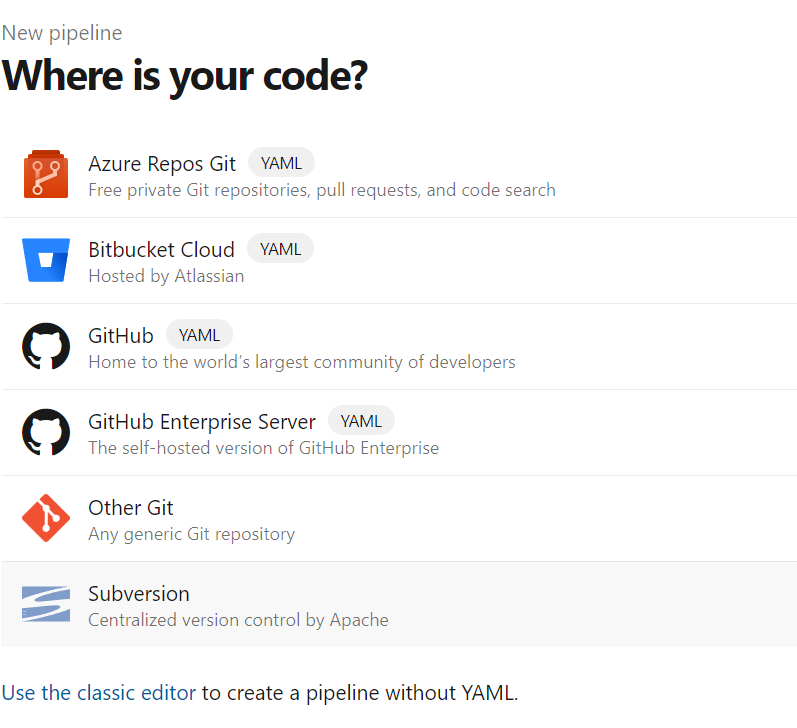
   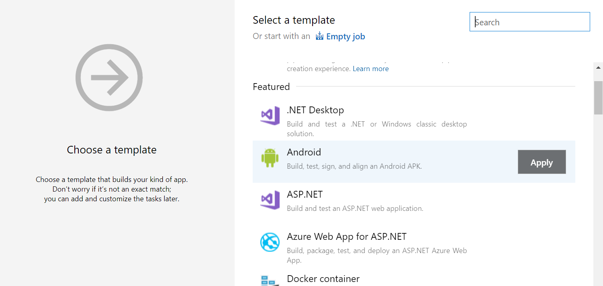
   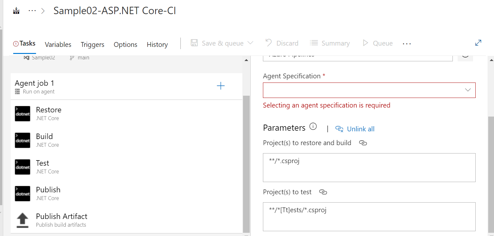
   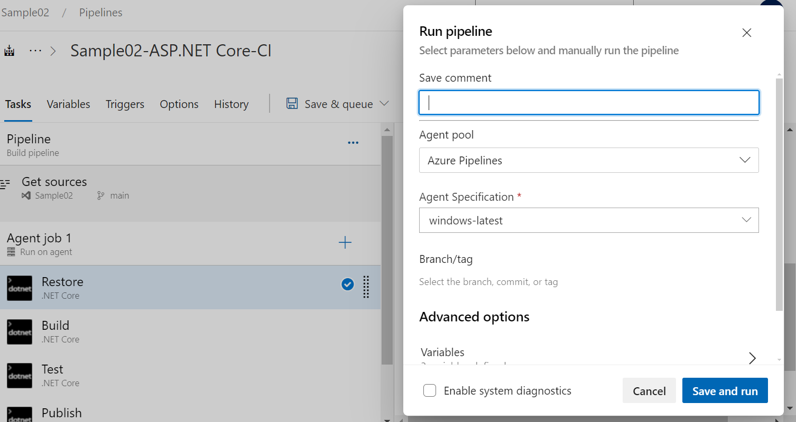
   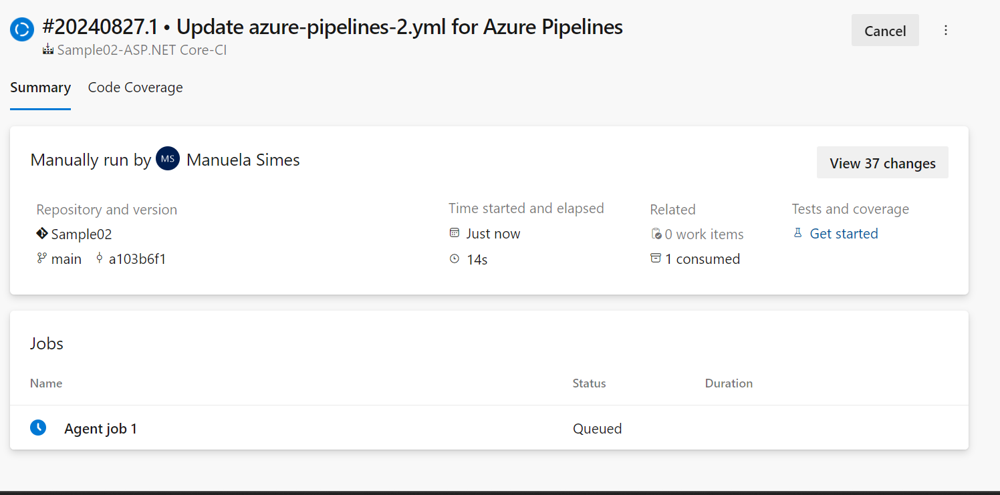
   

4.7 Configurar CI en ambos pipelines (YAML y Classic Editor). Mostrar resultados de la ejecución automática de ambos pipelines al hacer un commit en la rama main.
   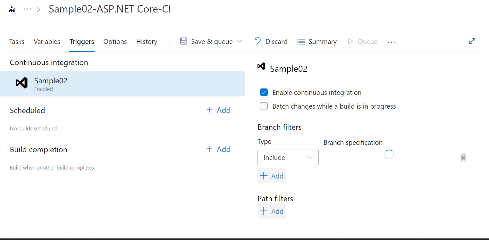
   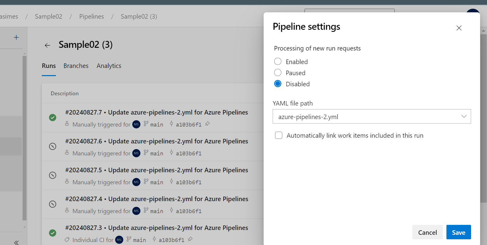
   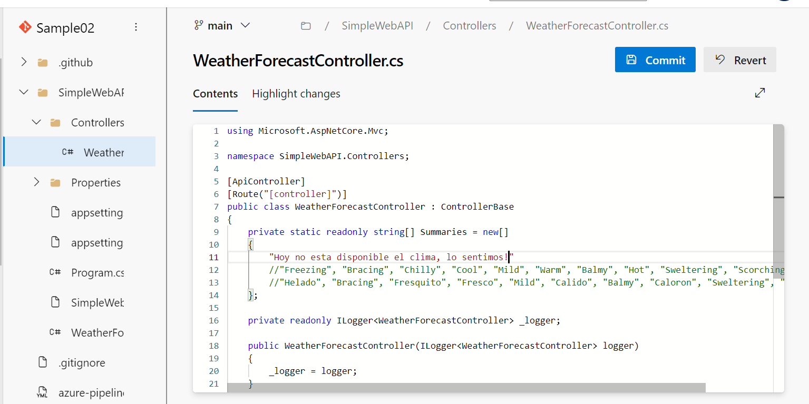
   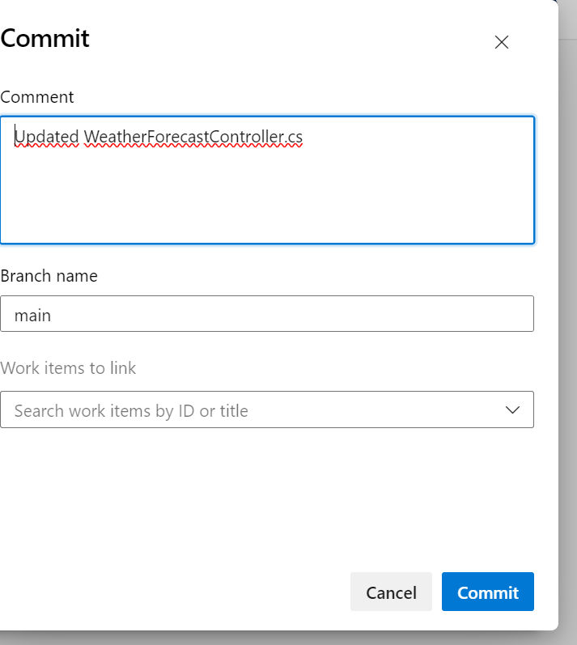
  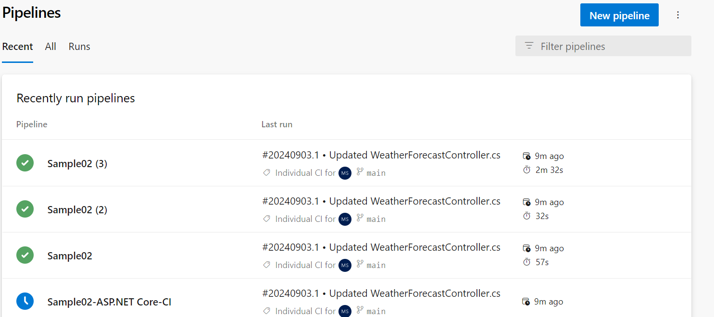

4.8 Explicar la diferencia entre un agente MS y un agente Self-Hosted. Qué ventajas y desventajas hay entre ambos? Cuándo es conveniente y/o necesario usar un Self-Hosted Agent?
Diferencia entre un Agente de Microsoft (MS) y un Agente Self-Hosted
1. Agente de Microsoft (MS Agent)

Descripción: Un agente de Microsoft, también conocido como agente hospedado en la nube, es un agente proporcionado y mantenido por Azure DevOps. Microsoft se encarga de la infraestructura, lo que incluye el aprovisionamiento, la configuración, el mantenimiento y la actualización del agente.
Configuración: No requiere configuración por parte del usuario; los agentes están listos para usarse inmediatamente.
Recursos: Microsoft proporciona una variedad de máquinas virtuales preconfiguradas con diferentes sistemas operativos, herramientas y software preinstalado para realizar las tareas de CI/CD.
Uso: Ideal para tareas estándar y cuando se necesita rapidez en la configuración sin preocuparse por el mantenimiento del hardware o software.
2. Agente Self-Hosted

Descripción: Un agente Self-Hosted es un agente que configuras y mantienes en tu propia infraestructura. Este puede estar ejecutándose en tu centro de datos, en la nube, o incluso en un servidor local.
Configuración: Requiere que configures y mantengas el agente, incluyendo la instalación de dependencias, actualizaciones y parches.
Recursos: Tienes control total sobre el entorno en el que se ejecuta el agente, incluyendo el hardware, el sistema operativo, las herramientas y cualquier software adicional que necesites.
Uso: Ideal para escenarios donde se requieren configuraciones personalizadas, acceso a recursos internos, o cuando las capacidades de los agentes de Microsoft no son suficientes.
Ventajas y Desventajas
Agente de Microsoft (MS Agent)

Ventajas:

Fácil Configuración: Listo para usar, sin necesidad de configuración adicional.
Mantenimiento: Microsoft se encarga de la actualización y mantenimiento del agente.
Disponibilidad: Alta disponibilidad con infraestructura de Microsoft en la nube.
Escalabilidad: Fácil de escalar según la demanda de ejecución de tareas.
Desventajas:

Limitaciones de Tiempo de Ejecución: Los agentes de Microsoft suelen tener límites en el tiempo de ejecución para cada trabajo.
Costo: Para grandes volúmenes de tareas, los costos pueden aumentar si se supera la cuota gratuita.
Menos Personalización: No puedes modificar la configuración del agente ni instalar software personalizado.
Agente Self-Hosted

Ventajas:

Control Total: Tienes control completo sobre el hardware, software y configuraciones.
Costos Controlados: Puedes aprovechar tu propia infraestructura, lo que puede reducir costos a largo plazo.
Acceso a Recursos Privados: Puede acceder a recursos internos que no están disponibles para agentes en la nube.
Sin Limitaciones de Ejecución: No hay límites de tiempo de ejecución impuestos por terceros.
Desventajas:

Mantenimiento: Eres responsable de la configuración, mantenimiento, actualizaciones y seguridad del agente.
Disponibilidad: Debes garantizar la disponibilidad y escalabilidad del agente.
Complejidad: La configuración inicial y la gestión continua pueden ser más complejas.
Cuándo es Conveniente y/o Necesario Usar un Agente Self-Hosted?
Requerimientos Específicos de Software: Cuando necesitas instalar herramientas, bibliotecas o software específicos que no están disponibles en los agentes de Microsoft.
Acceso a Recursos Internos: Cuando el pipeline necesita acceder a recursos internos de la empresa, como bases de datos, servidores o sistemas que no son accesibles desde la nube.
Control Total del Entorno: Cuando se requiere control total sobre el entorno de ejecución, ya sea por razones de seguridad, conformidad, o personalización avanzada.
Escalabilidad Controlada: Cuando tienes la infraestructura para manejar grandes volúmenes de compilaciones y quieres evitar los costos de los agentes hospedados en la nube.
Sin Restricciones de Ejecución: Cuando necesitas ejecutar trabajos que pueden exceder los límites de tiempo o recursos disponibles en los agentes de Microsoft.
4.8 Crear un Pool de Agentes y un Agente Self-Hosted

4.9 Instalar y correr un agente en nuestra máquina local.
4.10 Crear un pipeline que use el agente Self-Hosted alojado en nuestra máquina local.
4.11 Buscar el resultado del pipeline y correr localmente el software compilado.
4.12 Crear un nuevo proyecto en ADO clonado desde un repo que contenga una aplicación en Angular como por ejemplo https://github.com/ingsoft3ucc/angular-demo-project.git
4.13 Configurar un pipeline de build para un proyecto de tipo Angular como el clonado.
4.14 Habilitar CI para el pipeline.
4.15 Hacer un cambio a un archivo del proyecto (algún cambio en el HTML que se renderiza por ejemplo) y verificar que se ejecute automáticamente el pipeline.
4.16 Descargar el resultado del pipeline y correr en un servidor web local el sitio construido.
4.17 Mostrar el antes y el después del cambio.
