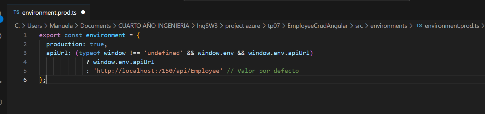
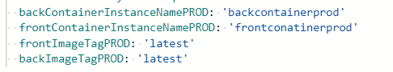

4.1 Modificar nuestro pipeline para construir imágenes Docker de back y front y subirlas a ACR
      
      
      
  4.1.2 Crear un recurso ACR en Azure Portal siguiendo el instructivo 5.1
        
              
  4.1.3 Modificar nuestro pipeline en la etapa de Build y Test
Aca tenemos para la publicacion del dockerfile de back: 

De forma analoga, como en el instructivo, hice lo mismo para el front. 
4.1.4 En caso de no contar en nuestro proyecto con una ServiceConnection a Azure Portal para el manejo de recursos, agregar una service connection a Azure Resource Manager como se indica en instructivo 5.2
Si contaba con una:

4.1.5 Agregar a nuestro pipeline variables

4.1.6 Agregar a nuestro pipeline una nueva etapa que dependa de nuestra etapa de Build y Test

4.1.7 - Ejecutar el pipeline y en Azure Portal acceder a la opción Repositorios de nuestro recurso Azure Container Registry. Verificar que exista una imagen con el nombre especificado en la variable backImageName asignada en nuestro pipeline

4.1.8 - Agregar tareas para generar imagen Docker de Front (DESAFIO)

4.1.9 - Agregar a nuestro pipeline una nueva etapa que dependa de nuestra etapa de Construcción de Imagenes Docker y subida a ACR
Agregar variables a nuestro pipeline:

Agregar variable secreta cnn-string-qa desde la GUI de ADO que apunte a nuestra BD de SQL Server de QA como se indica en el instructivo 5.3

Agregar tareas para crear un recurso Azure Container Instances que levante un contenedor con nuestra imagen de back

Para que funcione, debemos hacer lo siguiente de forma local:

4.1.10 - Ejecutar el pipeline y en Azure Portal acceder al recurso de Azure Container Instances creado. Copiar la url del contenedor y navegarlo desde browser. Verificar que traiga datos.
   

4.1.11 - Agregar tareas para generar un recurso Azure Container Instances que levante un contenedor con nuestra imagen de front (DESAFIO)
ANtes debemos modificar archivos de EmployeeCrudAngular: 

Subimos los cambios:

Luego:

4.1.12 - Agregar tareas para correr pruebas de integración en el entorno de QA de Back y Front creado en ACI.

Debemos hacer cambios en las pruebas:

Se corren correctamente:

4.2.4 Agregar etapa que dependa de la etapa de Deploy en ACI QA y genere contenedores en ACI para entorno de PROD.
Creamos un environment:

Agregamos nuevas variables:

Agregamos las tareas al pipeline:

Corremos el pipeline y aceptamso:

Se ejecuta correctamente:

